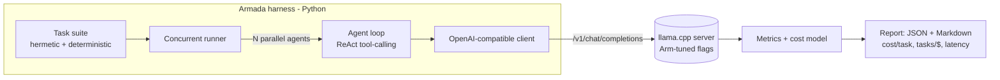

# Armada — run a *fleet* of AI agents on Arm CPUs

> **Arm-optimized agent-serving efficiency lab.** Armada measures how cheaply you can run a
> fleet of tool-calling AI agents on Arm64 (Neoverse) CPUs — **cost-per-task**,
> **tasks-per-dollar**, and **latency** — and compares it head-to-head with x86. No GPU required.

[](LICENSE)

Armada is built for the **Arm AI Optimization Challenge (Cloud AI track)**. It turns Arm's
"orchestrate many concurrent agents on the CPU" story into a **reproducible, measurable benchmark**
plus a set of **optimized serving recipes** that anyone can fork and re-run for free on
GitHub Actions Arm64 runners.

---

## Why this matters

Agentic workloads look nothing like single-shot inference:

- **Every agent step re-sends the same system prompt + tool schemas + history.** Caching that
  prefix (KV reuse) is a large, real saving.
- **Agents run in fleets** — many in flight at once. Throughput-per-core (continuous batching)
  is what decides cost, and per-watt throughput is exactly where Arm Neoverse wins.
- **Agent turns are short and tool-driven** — latency is dominated by *prompt prefill*, which maps
  onto the Arm `i8mm` / `dotprod` matmul paths used by llama.cpp + KleidiAI.

Armada is the harness that **proves** the win: it runs a fixed, deterministic agent task suite at
configurable concurrency, captures token/latency/cache metrics, and reports the dollars.

## What Armada does

- 🔎 **Detects the Arm CPU features** (`i8mm`, `dotprod`, `sve`, `sve2`, `bf16`) so the report shows
  exactly which acceleration paths were exercised.
- 🤖 **Runs a fleet of tool-calling agents** (ReAct-style loop) against a **hermetic** task suite —
  no network, fully reproducible.
- ⚙️ **Sweeps serving configs**: prefix/prompt caching on/off, parallel slots, continuous batching,
  thread count, quantization — so you can see what each optimization buys you.
- 💵 **Reports the economics**: cost-per-task, tasks-per-dollar, sustained concurrent agents, plus
  p50/p95 latency, tokens/sec, and prompt tokens saved by caching.
- 🆚 **Arm-vs-x86** comparison from one command / one CI run.
- 🧪 **Mock mode** so the entire pipeline runs anywhere (including x86 dev boxes and CI) without a
  model, which keeps tests fast and the benchmark logic verifiable.

## How it works



The serving layer is **llama.cpp** (KleidiAI micro-kernels under the hood) running with parallel
slots + continuous batching + prompt caching. The agent and measurement layers talk to it through
the standard OpenAI-compatible API, so the same harness can later target vLLM-CPU or any compatible
server.

## Metrics reported

| Metric | Why it matters |
|---|---|
| `cost_per_task_usd` | The headline economic number for an agent workload |
| `tasks_per_dollar` | "How many agent tasks per \$1 of Arm vs x86" |
| `sustained_agents` | Concurrency held within a latency SLA |
| `p50_task_latency_s` / `p95_task_latency_s` | Responsiveness under load |
| `tokens_per_sec` | Raw serving throughput |
| `cached_prompt_tokens` / `cache_hit_ratio` | The prefix-caching optimization, quantified |
| `arm_features` | Which Arm acceleration paths were active |

## Quickstart (works on any machine — mock mode)

```bash
python3 -m venv .venv && source .venv/bin/activate
pip install -e ".[dev]"

# Run the full agent benchmark against the deterministic mock model (no server needed)
armada bench --config configs/default.yaml --mock --out results/mock

# Render the report
armada report results/mock
```

This validates the whole pipeline (agent loop, tool calls, metrics, cost model, report) without a
GPU, a model, or even an Arm chip.

## Running on Arm64 (the real benchmark)

Recommended free Arm64 environments:

| Environment | Notes |
|---|---|
| **Oracle Cloud Always Free — Ampere A1** | 4 OCPU / 24 GB, Neoverse-N1. Free forever. Best for concurrency runs. |
| **GitHub Actions `ubuntu-24.04-arm`** | Free for public repos. Reproducible CI benchmarks (see below). |
| **AWS Graviton4 / Google Axion / Azure Cobalt** | For a hyperscaler Arm-vs-x86 chart (free trial credits). |

```bash
# 1. Build llama.cpp tuned for this host's Arm features
scripts/build_llama_cpp.sh

# 2. Download a small tool-calling model (GGUF, Q4_0 -> Arm i8mm path)
scripts/download_model.sh

# 3. Run the fleet benchmark against the real server
armada bench --config configs/default.yaml --out results/arm
armada report results/arm
```

## Reproduce it for free in CI

Every push runs the benchmark on a **free Arm64 runner** and posts the report to the workflow
summary — fork the repo and you get your own Arm benchmark with zero setup. See
[`.github/workflows/benchmark-arm.yml`](.github/workflows/benchmark-arm.yml).

## Project layout

```
src/armada/
  cpuinfo.py   # Arm feature detection
  tools.py     # hermetic agent tools (safe calculator, kv lookup)
  tasks.py     # deterministic agent task suite
  agent.py     # ReAct tool-calling loop
  client.py    # OpenAI-compatible client + deterministic mock
  server.py    # llama.cpp server lifecycle + Arm-tuned flags
  runner.py    # concurrent fleet runner
  metrics.py   # metrics + cost model
  report.py    # JSON + Markdown report
  cli.py       # `armada` entry point
```

## Status

Early scaffold. Mock-mode pipeline first; real llama.cpp serving + published Arm-vs-x86 results next.

## License

[Apache License 2.0](LICENSE).
